# Trabajo Práctico U3 N3: Automatización de Calidad y Blindaje

**Repositorio:** https://github.com/Maxepe/petrei-u3

El proyecto continúa el TP2: el paquete `tienda` contiene `calcular_descuento` y
`evaluar_solicitud_credito` con sus suites de pruebas, y suma un módulo heredado,
`pedidos.py`.

```
petrei-u3/
├── .githooks/pre-commit          # punto 1: cadena Formatter → Linter → Pruebas
├── .github/ISSUE_TEMPLATE/       # plantillas del TP1
├── docs/                         # el informe, evidencias y capturas
├── src/tienda/
│   ├── credito.py                # TP2 (branch coverage)
│   ├── descuentos.py             # TP2 (patrón AAA)
│   └── pedidos.py                # punto 2: módulo auditado y refactorizado
├── tests/
├── pyproject.toml                # configuración de black, ruff, pytest y coverage
├── requirements.txt              # dependencias
├── requirements-dev.txt          # herramientas de calidad
└── sonar-project.properties      # análisis estático con SonarQube local
```

**Herramientas:** Python 3.14; Black 26.5 (formatter); Ruff 0.16 (linter); pytest 9.1 +
pytest-cov 7.1 (pruebas y cobertura); radon 6.0 (complejidad); jscpd 4 (duplicación);
pip-audit 2.10 (CVE en dependencias); SonarQube Community en Docker (diagnóstico final).

---

## 1. Configuración de un pre-commit Hook

### 1.1 El script

Git ejecuta el archivo `pre-commit` del directorio de hooks después de `git commit` y antes
de crear el commit. El script vive en `.githooks/` y cada desarrollador lo activa una vez después de clonar:

```bash
git config core.hooksPath .githooks
```

`.githooks/pre-commit`:

```sh
#!/bin/sh
# Cadena de calidad: Formatter -> Linter -> Pruebas unitarias.

# configuramos encodng UTF-8
export PYTHONIOENCODING=utf-8

if [ -x .venv/Scripts/python.exe ]; then
    PY=.venv/Scripts/python.exe
elif [ -x .venv/bin/python ]; then
    PY=.venv/bin/python
else
    echo "pre-commit: no existe el entorno .venv (ver README)."
    exit 1
fi

abortar() {
    echo
    echo "pre-commit: COMMIT ABORTADO en la etapa '$1'."
    echo "Los cambios siguen en el área de preparación; corregí y volvé a ejecutar git commit."
    exit 1
}

echo "==> [1/3] Formatter: black --check"
"$PY" -m black --check --diff src tests || abortar "Formatter"

echo "==> [2/3] Linter: ruff check"
"$PY" -m ruff check src tests || abortar "Linter"

echo "==> [3/3] Pruebas unitarias y cobertura: pytest"
"$PY" -m pytest || abortar "Pruebas"
"$PY" - <<'EOF' || abortar "Cobertura de ramas"
import json, sys
totales = json.load(open("coverage.json"))["totals"]
ramas = 100 * totales["covered_branches"] / max(totales["num_branches"], 1)
print(f"Cobertura de ramas: {ramas:.1f}% (mínimo DoD: 75%)")
sys.exit(ramas < 75)
EOF

echo
echo "pre-commit: los 3 controles pasaron. Commit autorizado."
```

Los umbrales salen del Criterio 3 de la DoD del TP1. Están en `pyproject.toml` (config para el hook):

```toml
[tool.black]
line-length = 88
target-version = ["py314"]

[tool.ruff]
line-length = 88
target-version = "py314"

[tool.ruff.lint]
# E/F: errores de pycodestyle y pyflakes · B: bugbear · S: seguridad (bandit)
# C90: complejidad ciclomática · SIM: simplificables · PL: pylint
select = ["E", "F", "B", "S", "C90", "SIM", "PL"]

[tool.ruff.lint.mccabe]
max-complexity = 10

[tool.ruff.lint.per-file-ignores]
"tests/*" = ["S101", "PLR2004"]   # assert y valores literales son propios de un test

[tool.coverage.run]
relative_files = true

[tool.pytest.ini_options]
pythonpath = ["src"]
addopts = "--cov=tienda --cov-branch --cov-report=term-missing --cov-report=json --cov-report=xml --cov-report=html --cov-fail-under=80"
```

Cada etapa termina con `|| abortar`, así que la primera que
  falla corta la cadena y las siguientes no corren.

`--cov-fail-under=80` controla la cobertura total. Como
  coverage.py combina líneas y ramas en un solo número, el bloque final verifica aparte el
  mínimo del 75 % de ramas que exige la DoD.

### 1.2 Qué ocurre en la consola cuando un control falla

Primer intento de commit en la rama `technical-debt/1-refactor-pedidos`: solo se preparó
`requirements.txt` con las versiones nuevas, mientras el código heredado seguía en el
proyecto. Salida completa en [`evidencias/hook-rechazo.log`](evidencias/hook-rechazo.log).

- **Etapa 1 (Black):** pasa.
- **Etapa 2 (Ruff):** 46 hallazgos, cada uno con archivo, línea, columna y código de regla.
  Entre ellos están `C901` (complejidad 21 en `procesar_pedido`), `S506` (`yaml.load`
  inseguro) y `S501` (`verify=False`).
- **Resultado:** el hook imprime `COMMIT ABORTADO en la etapa 'Linter'` y termina con
  `exit code: 1`. La etapa 3 (pytest) no llega a ejecutarse.

Después del rechazo, `git log` seguía mostrando `1197d9a` como último commit y `git status`
mostraba `requirements.txt` todavía preparado (`M  requirements.txt`). En ese log los emojis
de Black aparecen escapados (`✨`) porque la consola de Windows no usa UTF-8; por eso el
hook final fuerza `PYTHONIOENCODING=utf-8`.

En caso de fallo:

1. El diff de formato para Black; archivo,
   línea, columna y código de regla para Ruff; el `assert` que falló con los valores
   esperado y obtenido para pytest.
2. `abortar` imprime en qué etapa se cortó la cadena y el script termina con `exit 1`.
3. Git cancela el commit para `exit code 1`. `HEAD` no se mueve y el mensaje escrito se descarta. 
   Los cambios siguen preparados listos para corregir por el dev.

### 1.3 Por qué esto protege la rama principal

Un commit que no supera las validaciones no avanza, así que no se puede pushear, no
aparece en un PR y no puede integrarse en `main`.

El hook, al ser local, tiene un límite. Si se ejecuta `git commit --no-verify` el hook se saltea, y un clon donde no se configuró `core.hooksPath` no lo ejecuta.
Por eso la DoD del TP1 exige también que el pipeline de CI repita los mismos controles.
El workflow `.github/workflows/calidad.yml` corre Black, Ruff, pytest y pip-audit en cada
push a `main` y en cada Pull Request. Al subir a `main` el código heredado, el CI lo
rechazó en la misma etapa que el hook:

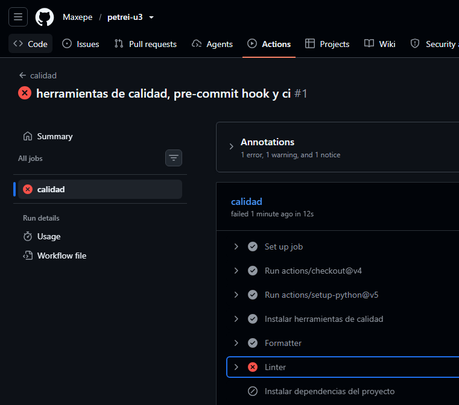

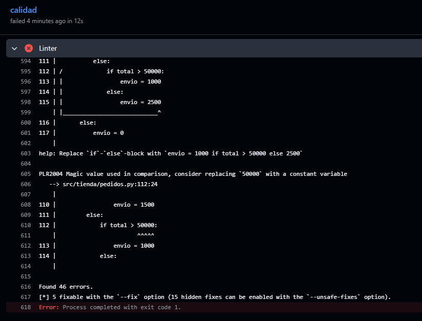

---

## 2. Auditoría Estática

### 2.1 Código auditado

`src/tienda/pedidos.py` calcula el total de un pedido y un presupuesto sin cupón. 
Reglas: descuento por volumen según categoría, descuento de
cliente (VIP 20 %, regular 5 %), costo de envío según tipo, provincia y monto, y cupones.
También notifica cada pedido.

```python
import os
import json
import yaml
import requests

CONFIG_PATH = "config.yaml"


def procesar_pedido(pedido, cliente, tipo_envio, cupon):
    config = yaml.load(open(CONFIG_PATH))
    total = 0
    for item in pedido["items"]:
        if item["categoria"] == "electronica":
            if item["cantidad"] >= 10:
                total = total + item["precio"] * item["cantidad"] * 0.90
            else:
                total = total + item["precio"] * item["cantidad"]
        elif item["categoria"] == "ropa":
            if item["cantidad"] >= 5:
                total = total + item["precio"] * item["cantidad"] * 0.85
            else:
                total = total + item["precio"] * item["cantidad"]
        elif item["categoria"] == "alimentos":
            total = total + item["precio"] * item["cantidad"]
        else:
            total = total + item["precio"] * item["cantidad"]
    if cliente["es_vip"] == True:
        total = total - total * 0.20
    else:
        total = total - total * 0.05
    if tipo_envio == "express":
        if cliente["provincia"] == "Buenos Aires":
            if total > 100000:
                envio = 0
            else:
                envio = 3000
        else:
            if total > 100000:
                envio = 2000
            else:
                envio = 5000
    elif tipo_envio == "normal":
        if cliente["provincia"] == "Buenos Aires":
            if total > 50000:
                envio = 0
            else:
                envio = 1500
        else:
            if total > 50000:
                envio = 1000
            else:
                envio = 2500
    else:
        envio = 0
    if cupon != None:
        if cupon == "DESC10":
            total = total - total * 0.10
        elif cupon == "DESC20":
            if total > 20000:
                total = total - total * 0.20
    total = total + envio
    try:
        requests.post(
            config["webhook_url"],
            data=json.dumps({"cliente": cliente["id"], "total": total}),
            verify=False,
        )
    except:
        pass
    return total


def calcular_presupuesto(pedido, cliente, tipo_envio):
    # lineas 74-118: copia literal de las líneas 11-55 de procesar_pedido,
    # sin el cupón ni la notificación.
    ...
```

### 2.2 Métricas de la línea base

Las cifras son la salida real de las herramientas sobre el tag `linea-base`.

**Complejidad ciclomática** ([`radon-linea-base.log`](evidencias/radon-linea-base.log)):
`procesar_pedido` tiene **21 (D)** y `calcular_presupuesto` **16 (C)**. Las funciones del
TP2 están en A, así que la complejidad se concentra en `pedidos.py`, cuyo promedio es 18,5.

**Índice de mantenibilidad** (mismo log): `pedidos.py` obtiene **28,37** sobre 100. Radon
lo califica A porque supera 20, pero esa letra no indica salud: el valor está apenas por
encima del límite de B.

**Duplicación** ([`jscpd-linea-base.log`](evidencias/jscpd-linea-base.log)): las líneas
74-118 de `pedidos.py` son una copia de las 11-55. Son 44 de sus 118 líneas, un
**37,29 %**. Medido sobre todo `src`, el mismo clon representa el 30,99 %.

**Linter** ([`ruff-linea-base.log`](evidencias/ruff-linea-base.log), reglas del
`pyproject.toml`): **46 hallazgos**.

| Regla | Cant. | Qué detecta |
| :-- | --: | :-- |
| PLR2004 | 15 | Números mágicos en comparaciones: 13 en `pedidos.py` (`100000`, `50000`, `20000`, `10`, `5`) y 2 en `credito.py` (`18`, `150000`, código del TP2) |
| SIM108 / PLR5501 / SIM102 | 15 | `if/else` anidados que se pueden colapsar |
| C901 / PLR0912 / PLR0915 | 5 | Complejidad, ramas y sentencias por encima del límite |
| E712 / E711 | 3 | `== True` y `!= None` |
| **S506** | 1 | **`yaml.load` sin `Loader`: deserialización insegura** |
| **S501** | 1 | **`verify=False`: certificado TLS sin validar** |
| **S113** | 1 | **Petición HTTP sin `timeout`: puede bloquear el proceso** |
| E722 / S110 / SIM105 | 3 | `except: pass`: silencia cualquier error, incluido `KeyboardInterrupt` |
| SIM115 | 1 | `open()` sin `with`: el archivo nunca se cierra |
| F401 | 1 | `import os` sin uso |

**Dependencias** ([`pip-audit-linea-base.log`](evidencias/pip-audit-linea-base.log)):
**16 vulnerabilidades únicas en 3 paquetes**.

pip-audit informa "30 known vulnerabilities" porque lista dos veces las entradas que tienen
alias en más de una base; sin repetir son 16.

| Paquete | Versión | CVE (selección) | Corregido en |
| :-- | :-- | :-- | :-- |
| PyYAML | 5.3.1 | CVE-2020-14343: ejecución de código arbitrario vía `yaml.load` / `FullLoader` | 5.4 |
| requests | 2.25.1 | CVE-2023-32681 (filtra `Proxy-Authorization`), CVE-2024-35195 (una `Session` sigue sin verificar TLS después de un `verify=False`), CVE-2024-47081 (filtra credenciales de `.netrc`), CVE-2026-25645 | 2.31.0 – 2.33.0 |
| urllib3 | 1.26.4 | 11 CVE, entre ellos CVE-2021-33503 (ReDoS), CVE-2023-43804 (`Cookie` en redirecciones), CVE-2023-45803 y CVE-2024-37891 | 1.26.5 – 2.8.0 |

**Pruebas:** el módulo no tiene ninguna. Su cobertura es 0 %. La del proyecto completo es
10,3 % de líneas y 8,1 % de ramas, y viene solo de las funciones del TP2. SonarQube combina
ambas en un 9,4 %.

**SonarQube Community (Docker, versión `linea-base`)**

El Quality Gate por defecto ("Sonar way") evalúa solo el código nuevo. En un primer
análisis no hay código nuevo, así que aprobaba un código con un bug bloqueante. Por eso se
creó el Quality Gate "DoD TP1", que evalúa todo el código con los umbrales de la DoD:
cobertura ≥ 80 %, duplicación ≤ 3 % y calificación A en confiabilidad, seguridad y
mantenibilidad.

| Condición | Valor | Estado |
| :-- | --: | :-- |
| Reliability Rating | E | ❌ |
| Security Rating | D | ❌ |
| Maintainability Rating | A | ✅ |
| Coverage | 9,4 % | ❌ |
| Duplicated Lines | 60,3 % | ❌ |

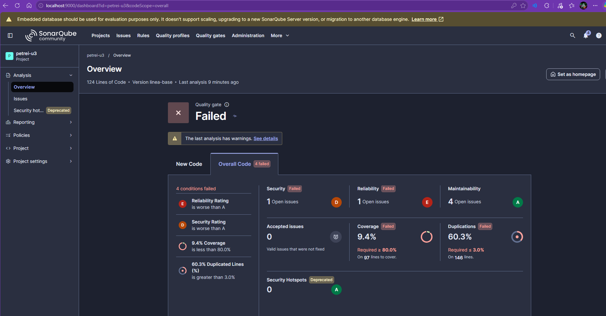

Los 6 hallazgos que reporta:

| Regla | Severidad | Línea | Hallazgo |
| :-- | :-- | --: | :-- |
| python:S930 | Blocker (Reliability) | 10 | `yaml.load` sin el argumento `Loader`. Con PyYAML 6 esa llamada lanza `TypeError`: un bug latente que aparece al actualizar la dependencia |
| python:S4830 | High (Security) | 66 | Certificado TLS sin validar (`verify=False`) |
| python:S3776 | High (Maintainability) | 9 | Complejidad cognitiva 49 en `procesar_pedido` (máximo 15) |
| python:S3776 | High (Maintainability) | 73 | Complejidad cognitiva 41 en `calcular_presupuesto` |
| python:S1192 | High (Maintainability) | 32 | Literal `"Buenos Aires"` repetido 4 veces |
| python:S5754 | High (Maintainability) | 68 | `except:` sin clase de excepción |

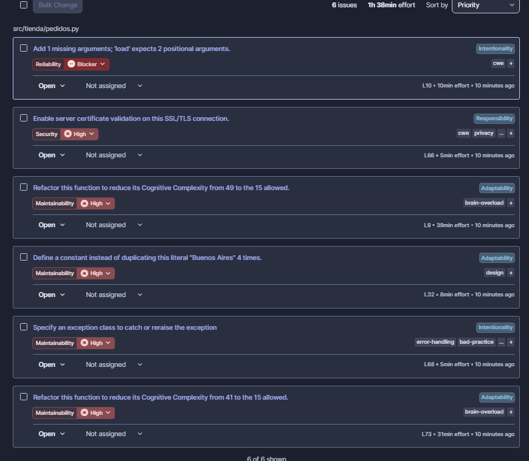

La mantenibilidad sale A aunque hay dos funciones con
complejidad cognitiva del triple del máximo. SonarQube calcula esa nota como deuda
estimada sobre el tamaño del código, el cual es poco.

### 2.3 Puntos críticos

Ordenados por riesgo:

1. **Seguridad combinada entre código y dependencias.** quien controle `config.yaml`
   ejecuta código en el servidor. `verify=False` abre la puerta a un ataque de intermediario.
2. **Complejidad ciclomática 21 en `procesar_pedido`.** Supera el umbral habitual de 10 y
   significa 21 caminos independientes.
3. **Duplicación del 37 %.** `calcular_presupuesto` copia 44 líneas de `procesar_pedido`.
4. **Errores silenciados.** `except: pass` hace que una caída del webhook, un `KeyError` en
   la configuración o un error de programación pasen inadvertidos.
5. **Acoplamiento a infraestructura.** La función lee un archivo y hace una petición HTTP
   real en cada llamada. No se puede probar sin red ni sin `config.yaml`.

### 2.4 Estrategia de refactorización

| Problema | Técnica | Resultado |
| :-- | :-- | :-- |
| `if` anidados de envío y cupones | **Reemplazar condicional por tabla de datos:** las 4 tarifas y los 2 cupones pasan a diccionarios de `dataclass` inmutables | La lógica queda en una línea; agregar una tarifa es agregar una entrada, sin ramas nuevas |
| Descuento por categoría | Tabla `REGLAS_POR_CATEGORIA` + **Extract Function** `calcular_importe_item` | Una sola regla con CC 3 en lugar de 4 ramas por cada función |
| 44 líneas duplicadas | **Extract Function** `_total_con_descuento_de_cliente`, usada por `procesar_pedido` y `calcular_presupuesto` | 0 % de duplicación |
| Regla VIP repetida | **Reutilizar** `calcular_descuento` del TP2 | La regla vive en un solo lugar, ya probado |
| Números mágicos | Constantes con nombre (`PROVINCIA_LOCAL`, umbrales dentro de las tablas; `EDAD_MINIMA` e `INGRESOS_MINIMOS` en `credito.py`) | Las reglas de negocio se leen como datos |
| HTTP y archivo dentro de la lógica | **Inyección de dependencias:** `procesar_pedido` recibe `notificar`, y `crear_notificador_webhook` construye la implementación real | La lógica se prueba con un Mock (TP2) que verifica la notificación |
| `yaml.load`, `verify=False`, sin `timeout`, `except: pass` | `yaml.safe_load` dentro de `with`, verificación TLS por defecto, `timeout=5`, captura de `requests.RequestException` con `logger.warning` | Se eliminan los hallazgos S506, S501, S113, S110 y E722 |
| Dependencias vulnerables | Actualizar a las últimas versiones estables y fijarlas | 0 vulnerabilidades conocidas |

Para asegurar la seguridad de las dependencias a futuro se propone:

1. `pip-audit -r requirements.txt` como paso del pipeline de CI.
2. Dependabot activado en el repositorio, para recibir un PR automático cuando una
   dependencia publica un parche de seguridad.
3. Versiones fijadas (`==`) en `requirements.txt`, para que el build sea reproducible y la
   auditoría analice exactamente lo que se instala.

Para asegurarnos que el refactor no cambia el comportamiento consideramos un arnés de
caracterización que ejecuta el código heredado y el refactorizado con las mismas entradas y
compara resultados.

### 2.5 Código refactorizado

`src/tienda/pedidos.py`:

```python
"""Pedidos: subtotal por categoría, descuento de cliente, cupón y envío."""

import logging
from collections.abc import Callable
from dataclasses import dataclass
from pathlib import Path

import requests
import yaml

from tienda.descuentos import calcular_descuento

logger = logging.getLogger(__name__)

Notificador = Callable[[dict], None]

PROVINCIA_LOCAL = "Buenos Aires"


@dataclass(frozen=True)
class ReglaVolumen:
    cantidad_minima: int
    factor: float


@dataclass(frozen=True)
class TarifaEnvio:
    umbral_bonificacion: float
    costo_bonificado: float
    costo_estandar: float

    def costo(self, total: float) -> float:
        if total > self.umbral_bonificacion:
            return self.costo_bonificado
        return self.costo_estandar


@dataclass(frozen=True)
class Cupon:
    porcentaje: float
    total_minimo: float = 0


REGLAS_POR_CATEGORIA = {
    "electronica": ReglaVolumen(cantidad_minima=10, factor=0.90),
    "ropa": ReglaVolumen(cantidad_minima=5, factor=0.85),
}

# Clave: (tipo de envío, ¿destino en la provincia local?)
TARIFAS_ENVIO = {
    ("express", True): TarifaEnvio(100_000, 0, 3_000),
    ("express", False): TarifaEnvio(100_000, 2_000, 5_000),
    ("normal", True): TarifaEnvio(50_000, 0, 1_500),
    ("normal", False): TarifaEnvio(50_000, 1_000, 2_500),
}

CUPONES = {
    "DESC10": Cupon(porcentaje=0.10),
    "DESC20": Cupon(porcentaje=0.20, total_minimo=20_000),
}


def calcular_importe_item(item: dict) -> float:
    importe = item["precio"] * item["cantidad"]
    regla = REGLAS_POR_CATEGORIA.get(item["categoria"])
    if regla and item["cantidad"] >= regla.cantidad_minima:
        return importe * regla.factor
    return importe


def calcular_subtotal(items: list[dict]) -> float:
    return sum(calcular_importe_item(item) for item in items)


def calcular_envio(total: float, tipo_envio: str, provincia: str) -> float:
    tarifa = TARIFAS_ENVIO.get((tipo_envio, provincia == PROVINCIA_LOCAL))
    return tarifa.costo(total) if tarifa else 0


def aplicar_cupon(total: float, codigo: str | None) -> float:
    cupon = CUPONES.get(codigo)
    if cupon is None or total <= cupon.total_minimo:
        return total
    return total - total * cupon.porcentaje


def _total_con_descuento_de_cliente(pedido: dict, cliente: dict) -> float:
    subtotal = calcular_subtotal(pedido["items"])
    return subtotal - calcular_descuento(subtotal, cliente["es_vip"])


def calcular_presupuesto(pedido: dict, cliente: dict, tipo_envio: str) -> float:
    total = _total_con_descuento_de_cliente(pedido, cliente)
    return total + calcular_envio(total, tipo_envio, cliente["provincia"])


def procesar_pedido(
    pedido: dict,
    cliente: dict,
    tipo_envio: str,
    cupon: str | None,
    notificar: Notificador,
) -> float:
    total = _total_con_descuento_de_cliente(pedido, cliente)
    envio = calcular_envio(total, tipo_envio, cliente["provincia"])
    total = aplicar_cupon(total, cupon) + envio
    notificar({"cliente": cliente["id"], "total": total})
    return total


def crear_notificador_webhook(ruta_config: Path, timeout: float = 5) -> Notificador:
    with ruta_config.open(encoding="utf-8") as archivo:
        url = yaml.safe_load(archivo)["webhook_url"]

    def notificar(datos: dict) -> None:
        try:
            requests.post(url, json=datos, timeout=timeout).raise_for_status()
        except requests.RequestException as error:
            logger.warning("No se pudo notificar el pedido: %s", error)

    return notificar
```

El orden del cálculo se mantiene a propósito: el envío se calcula sobre el total
después del descuento de cliente y antes del cupón, igual que en el código
heredado. Cambiar ese orden alteraría qué pedidos tienen envío bonificado.

`src/tienda/credito.py` (TP2) solo cambia los literales por constantes:

```python
EDAD_MINIMA = 18
INGRESOS_MINIMOS = 150000


def evaluar_solicitud_credito(edad: int, ingresos: float, posee_garantia: bool) -> str:
    ...
    if (edad >= EDAD_MINIMA and ingresos >= INGRESOS_MINIMOS) or posee_garantia:
```

`tests/test_pedidos.py` suma 21 pruebas con el patrón AAA del TP2. Cubren los bordes de
cada umbral (por ejemplo, un total de exactamente 100 000 no bonifica el envío express),
un tipo de envío sin tarifa, un cupón inexistente o nulo y el pedido vacío. También usan
los dos dobles de prueba del TP2:

- **Mock:** `procesar_pedido` recibe un `Mock()` como notificador, y el test verifica con
  `assert_called_once_with` que se notificó una sola vez y con el total correcto.
- **Stub:** para la caída del webhook, `requests.post` se reemplaza por un stub que lanza
  `ConnectionError`. El test verifica que el error queda registrado en el log y que no
  interrumpe el pedido.

`requirements.txt` actualizado:

```text
PyYAML==6.0.3
requests==2.34.2
urllib3==2.8.0
```

### 2.6 Métricas después del refactor

Salidas completas en [`radon-final.log`](evidencias/radon-final.log),
[`jscpd-final.log`](evidencias/jscpd-final.log), [`ruff-final.log`](evidencias/ruff-final.log)
y [`pip-audit-final.log`](evidencias/pip-audit-final.log).

| Métrica | Línea base | Refactor | Herramienta |
| :-- | --: | --: | :-- |
| Complejidad ciclomática máxima en `pedidos.py` | 21 (D) | 3 (A) | radon cc |
| Complejidad ciclomática promedio del proyecto | 11,0 (C) | 2,0 (A) | radon cc |
| Índice de mantenibilidad de `pedidos.py` | 28,37 | 47,59 | radon mi |
| Complejidad cognitiva | 49 en una sola función | 14 sumando todo el proyecto | SonarQube |
| Líneas duplicadas en `pedidos.py` | 37,29 % | 0 % | jscpd |
| Hallazgos del linter | 46 | 0 | ruff |
| Hallazgos de SonarQube (bugs / vulnerabilidades / code smells) | 1 / 1 / 4 | 0 / 0 / 0 | SonarQube |
| Vulnerabilidades en dependencias | 16 | 0 | pip-audit |
| Cobertura de líneas / ramas (proyecto) | 10,3 % / 8,1 % | 100 % / 100 % | pytest-cov |
| Quality Gate "DoD TP1" | Failed | Passed | SonarQube |

El índice de mantenibilidad de `pedidos.py` sube de 28 a 47.

---

## 3. Informe de Calidad en Verde

| | |
| :-- | :-- |
| **Cambio certificado** | Refactorización de `src/tienda/pedidos.py` y actualización de dependencias |
| **Issue** | [#1 — [TECH-DEBT] pedidos.py: complejidad, duplicación y dependencias vulnerables](https://github.com/Maxepe/petrei-u3/issues/1) |
| **Pull Request** | [#2 — [TECH-DEBT] Refactor de pedidos.py: complejidad, duplicación y dependencias vulnerables](https://github.com/Maxepe/petrei-u3/pull/2) |
| **Rama** | `technical-debt/1-refactor-pedidos` → `main` |
| **Commit evaluado** | `378425f` (02/10/2026) |
| **Línea base de comparación** | tag `linea-base` (`896d493`) |

### 3.1 Evidencia de gobernanza de entrada: Issue ↔ Pull Request

La tarea nació en un issue estructurado y se integró por un Pull Request trazable:

1. **Etiquetas.** El repositorio tiene las seis etiquetas de la matriz de categorización del
   TP1, con sus colores.

   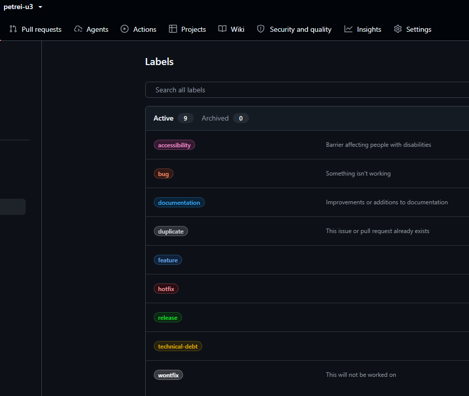

2. **Issue #1.** Se creó con la plantilla **Deuda Técnica** (`.github/ISSUE_TEMPLATE/`),
   derivada de la plantilla del TP1, y quedó etiquetado `technical-debt`. Registra el commit
   analizado, las métricas de la línea base con su umbral aceptable, el riesgo, la
   estrategia y los criterios de aceptación.

   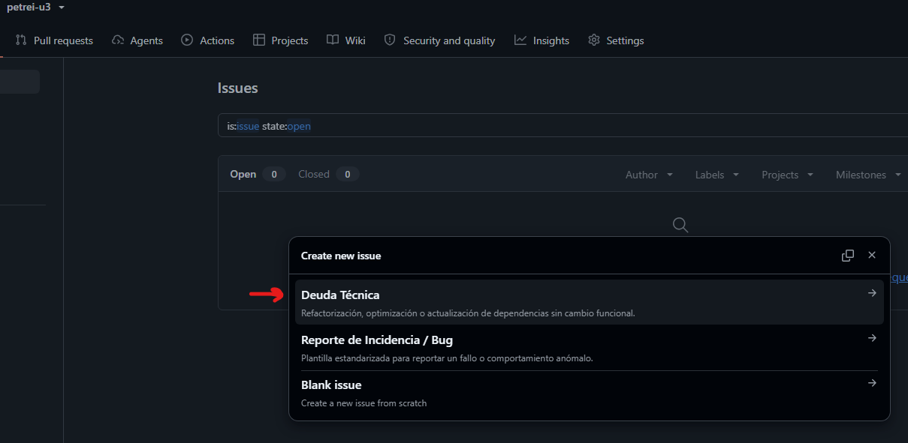

   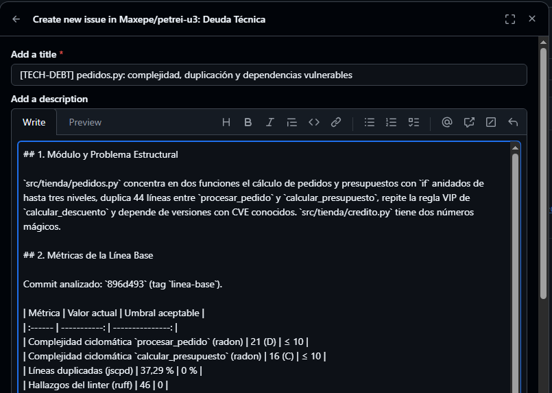

   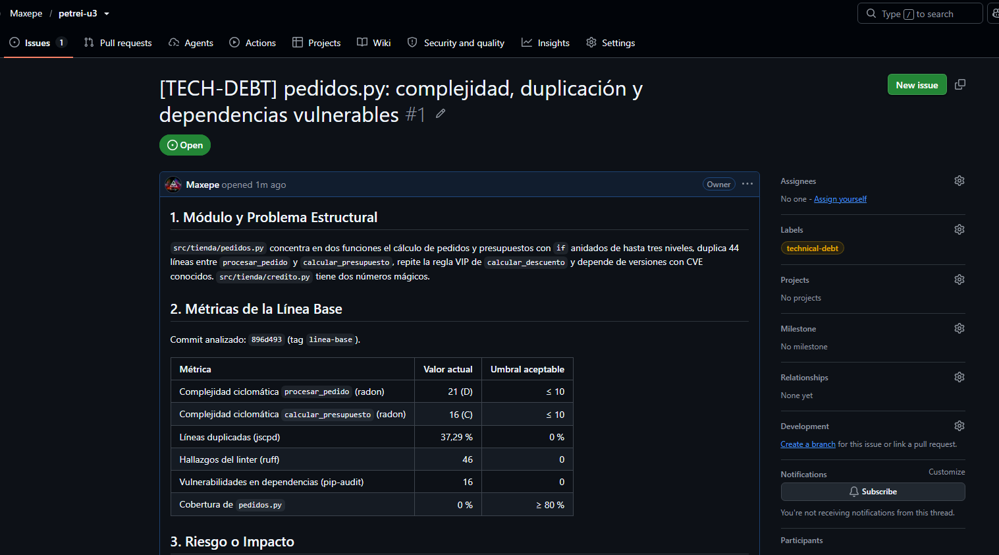

3. **Rama.** El nombre `technical-debt/1-refactor-pedidos` lleva el tipo de tarea y el número
   del issue (sección 4.1 de la teoría).

4. **Pull Request #2.** La descripción empieza con la palabra clave `Closes #1`, así que
   GitHub registra el vínculo y cierra el issue automáticamente al integrar. El PR lleva la etiqueta
   `technical-debt`, el resumen de cambios, la tabla de métricas antes y después y el
   checklist de la DoD.

   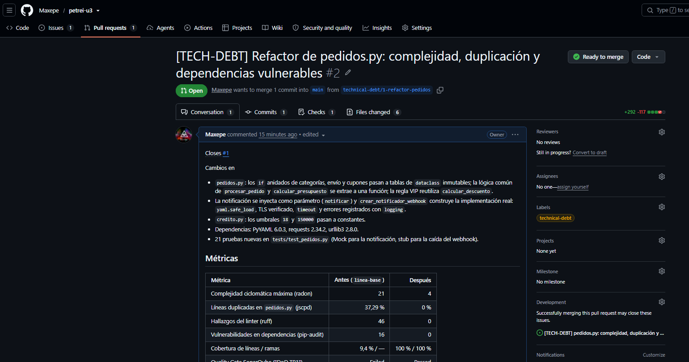

5. **CI del PR.** El workflow `calidad` corrió sobre el PR y terminó en verde:
   [ejecución en GitHub Actions](https://github.com/Maxepe/petrei-u3/actions/runs/37074725640).

   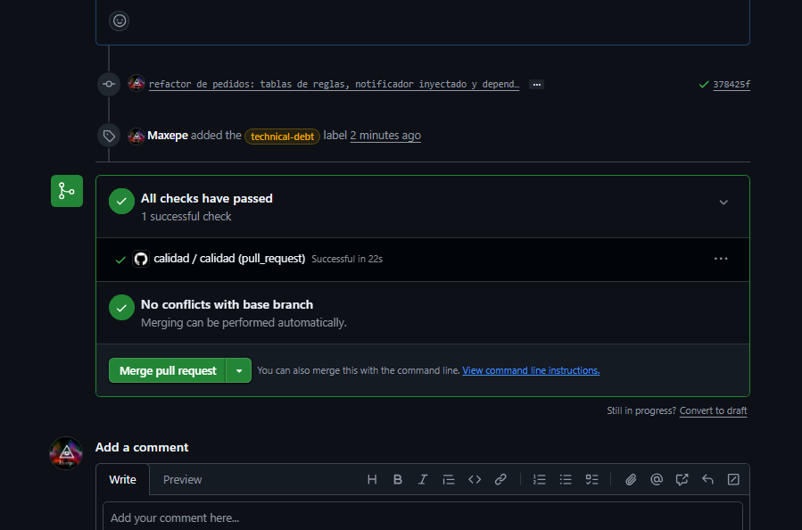

6. **Revisión.** para simular la aprobación de un par consideré una **auto-revisión documentada**:
   una review de tipo *Comment* con un checklist de lógica, legibilidad, seguridad, pruebas
   y requerimientos, que queda registrada con fecha en el PR.

   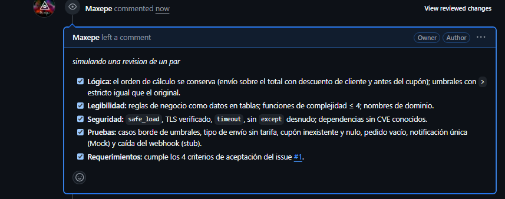

### 3.2 Evidencia sintáctica y estática: logs del pre-commit hook

Salida completa del hook en el commit del refactor:
[`evidencias/hook-verde.log`](evidencias/hook-verde.log).

| Etapa | Resultado |
| :-- | :-- |
| 1. Formatter (Black) | 7 archivos sin cambios de formato |
| 2. Linter (Ruff) | `All checks passed!` |
| 3. Pruebas (pytest) | 29 pasan; cobertura 100 % total y 100 % de ramas |
| Hook | `Commit autorizado`, `exit code: 0`, se crea el commit `378425f` |

Comparado con el rechazo del punto 1.2, el mismo hook pasó de **46 hallazgos del linter
y commit abortado** a **0 hallazgos y commit autorizado**. El CI repitió la cadena en un
entorno limpio (Ubuntu) con el mismo resultado (sección 3.1, punto 5).

### 3.3 Evidencia dinámica: reporte de cobertura

La suite pasa de 8 a 29 pruebas: 29 pasan, 0 fallan y ninguna se skipea. La cobertura
queda en 100 % de sentencias (73/73) y 100% de ramas (12/12) en los cuatro módulos. 
El detalle por módulo está en el reporte HTML de abajo y en la salida de pytest de [`hook-verde.log`](evidencias/hook-verde.log).

`pedidos.py` tiene 6 ramas cuando antes tenía 68. Las decisiones que eran `if` anidados
ahora son búsquedas en tablas, y cubrir sus ramas pide pocos casos.

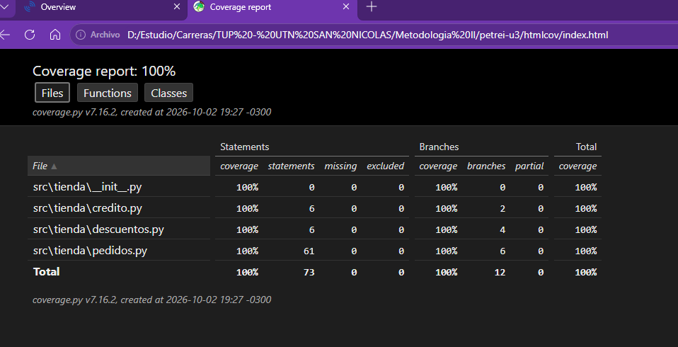

### 3.4 Evidencia estructural: diagnóstico de análisis estático

**SonarQube (versión `refactor`): Quality Gate "DoD TP1" Passed**

| Indicador | Línea base | Final |
| :-- | --: | --: |
| Quality Gate | Failed | **Passed** |
| Bugs (Reliability) | 1 (E) | **0 (A)** |
| Vulnerabilidades (Security) | 1 (D) | **0 (A)** |
| Code smells (Maintainability) | 4 (A) | **0 (A)** |
| Security hotspots | 0 | **0** |
| Deuda técnica estimada | 83 min | **0 min** |
| Duplicación | 60,3 % | **0,0 %** |
| Cobertura | 9,4 % | **100 %** |
| Complejidad ciclomática (suma) | 36 | **23** |
| Complejidad cognitiva (suma) | 96 | **14** |
| Líneas de código | 124 | **97** |

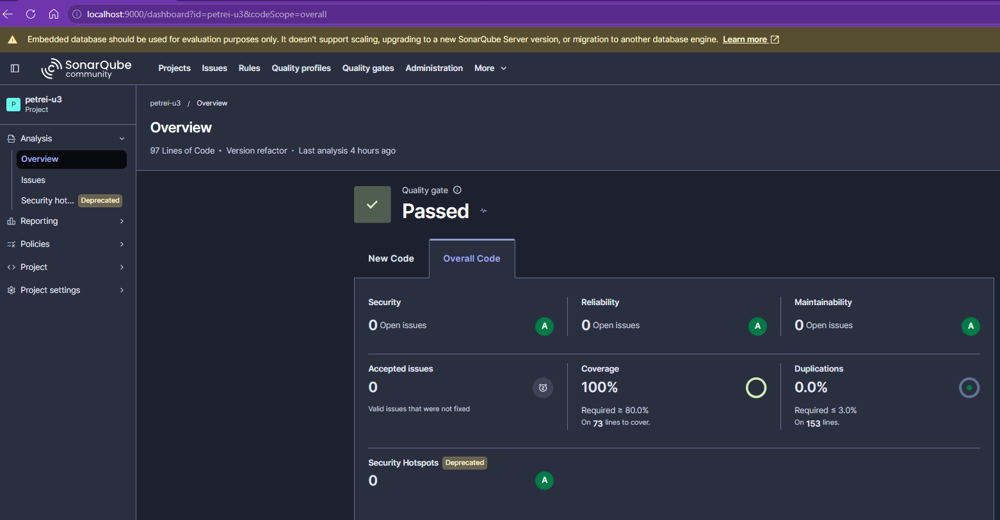

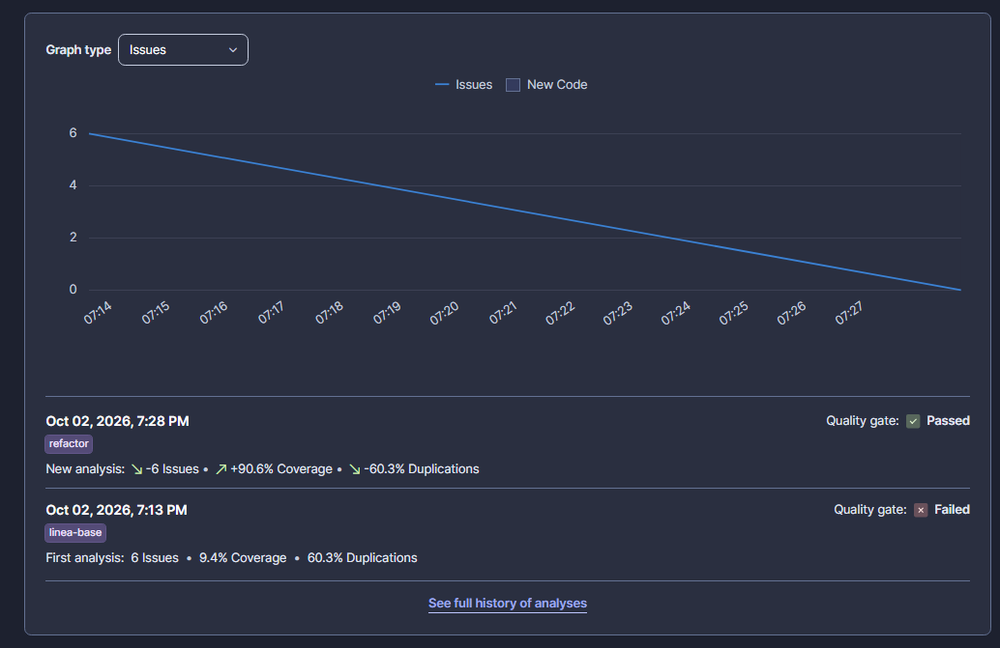

**Seguridad de dependencias** ([`pip-audit-final.log`](evidencias/pip-audit-final.log)):
`No known vulnerabilities found`. La auditoría final resuelve el árbol completo de
dependencias, incluidas las transitivas de requests (`certifi`, `idna`,
`charset-normalizer`). La de la línea base había encontrado 16.

**Análisis estático por CLI:** radon da 14 bloques con máximo A (4) y promedio A (2,0),
Ruff no tiene hallazgos y jscpd no encuentra clones (logs `*-final.log`, sección 2.6).

### 3.5 Certificación contra la Definition of Done

| Criterio de la DoD (TP1) | Evidencia | Estado |
| :-- | :-- | :-- |
| 1. Integridad de compilación | El proyecto instala y ejecuta en Python 3.14, localmente y en el CI (3.1.5, 3.2). La línea base no instalaba por PyYAML 5.3.1 | ✅ |
| 2. Pruebas automatizadas en verde | 29 pruebas, 0 fallidas, 0 salteadas (3.2, 3.3) | ✅ |
| 3. Cobertura ≥ 80 % de líneas y ≥ 75 % de ramas | 100 % y 100 % (3.3) | ✅ |
| 4. PR revisado y aprobado | Auto-revisión documentada en el PR #2 (3.1.6). Limitación: no hubo un par revisor | ✅ con observación |
| 5. Linting y formato | Black y Ruff sin hallazgos en el hook y en el CI (3.2) | ✅ |
| 6. Documentación técnica | README con instalación, activación del hook y comandos; este informe; evidencias en `docs/evidencias/` | ✅ |

**Conclusión: apto para integrar.** El commit `378425f` cumple los seis criterios de la
Definition of Done. La única observación es el Criterio 4, donde la revisión fue del propio
autor por tratarse de un trabajo individual. Queda pendiente, fuera del alcance de este
cambio, activar la protección de rama sobre `main`, exigiendo el check `calidad` para
hacer merge, y Dependabot (sección 2.4).
